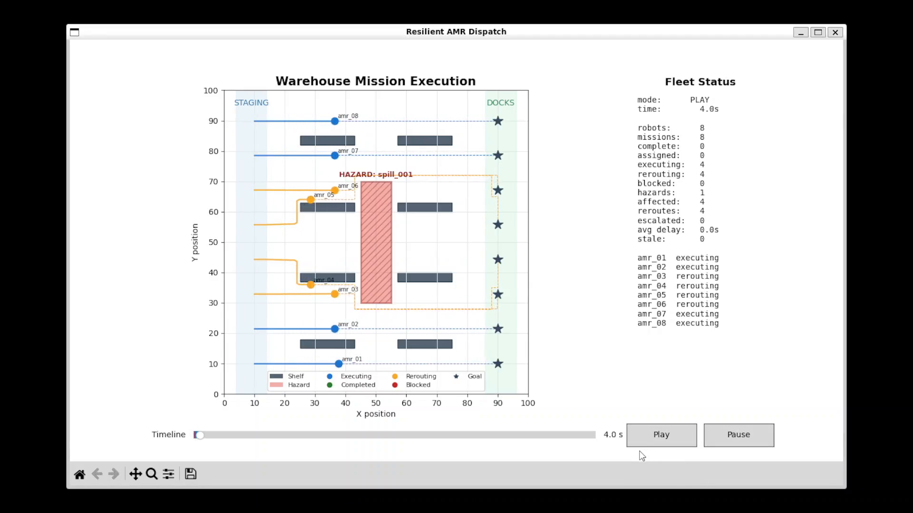
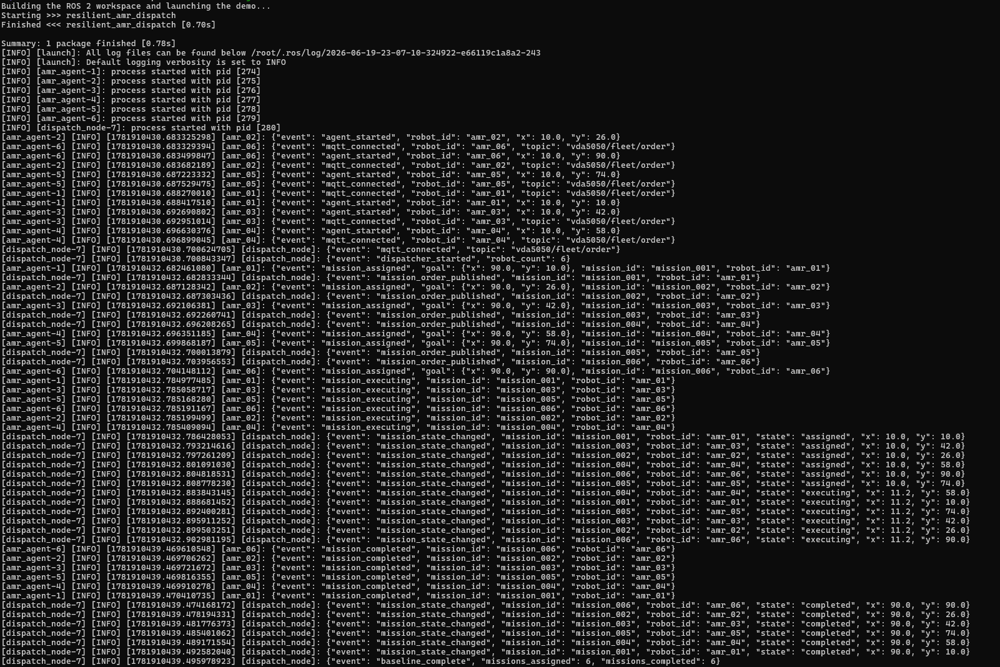
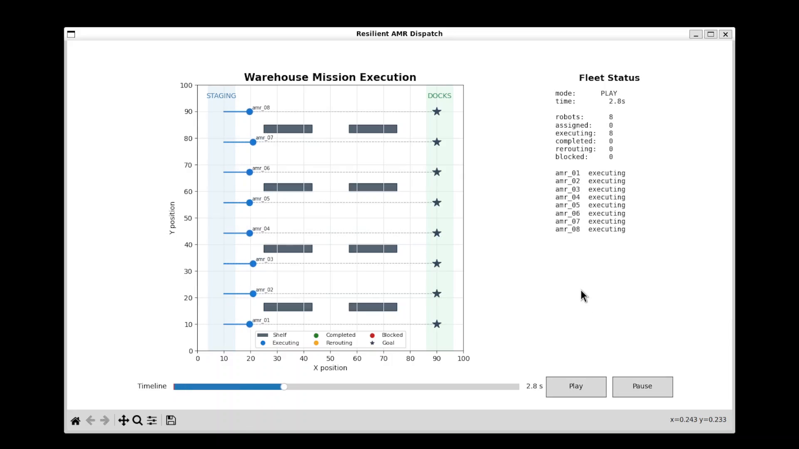
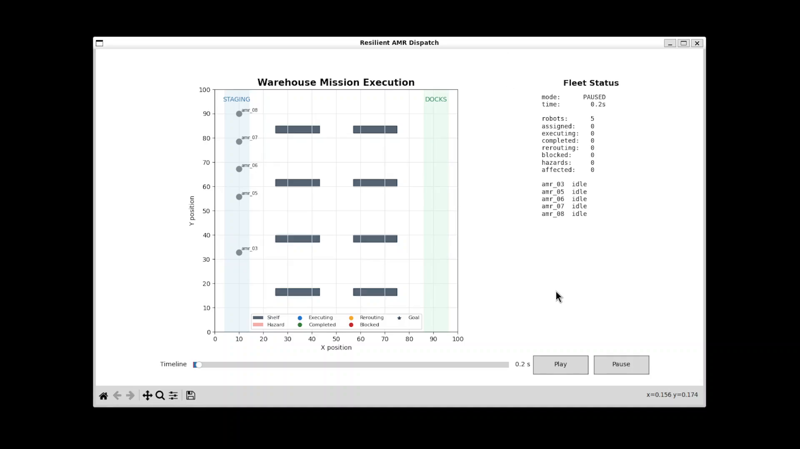
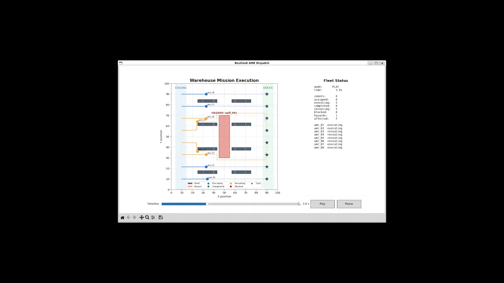

# Resilient AMR Dispatch

A deterministic ROS 2 Jazzy and MQTT simulation of centralized warehouse AMR
dispatch with robot-side recovery. Eight robots receive missions over MQTT,
publish live ROS 2 telemetry, avoid injected hazards and occupied robot goals,
and report recovery results to a fleet monitor and interactive visualization.

The project demonstrates a clear division of responsibility: central dispatch
owns mission objectives, while each robot provides bounded local recovery when
an unexpected event invalidates its assigned route. Affected robots stop,
replan to the original goal within defined limits, and report or escalate the
outcome. Handling these execution-level disruptions locally reduces avoidable
control-plane load and response latency at mission control while preventing
prolonged stops and inefficient routing across the fleet.

## Demo Video

[](https://JolimC.github.io/Resilient_AMR_Dispatch/phase5_demo.html)

Click the image to view the Phase 5 demonstration of dispatch, hazard recovery,
and final fleet metrics.

## Architecture

```text
dispatch_node -- MQTT orders --> amr_agent (6-12 instances)
                                      |
hazard_injector -- ROS 2 hazard ------+-- ROS 2 state --> visualizer
        |                             |                      |
        +-- MQTT hazard               +-- MQTT exception --> fleet_monitor
                                                               |
                                             metrics + final JSON summary
```

- `dispatch_node` owns business-level mission assignment.
- `amr_agent` follows the assigned route and performs bounded local A* recovery.
- `hazard_injector` creates a deterministic blocked zone during execution.
- `fleet_monitor` aggregates mission, hazard, recovery, delay, and health metrics.
- `visualizer` provides the live map, status panel, timeline playback, and captures.
- Mosquitto carries VDA5050-inspired orders and event reports; ROS 2 carries live
  simulation state.

## Current Implementation Boundaries

The project uses small, inspectable components in place of production robotics
infrastructure:

| Production capability | Current implementation |
|---|---|
| Mission dispatch and control | Custom `dispatch_node` assigning deterministic missions |
| Robot navigation and recovery | Simplified motion with local grid-based A* planning |
| Robot and warehouse simulation | Fixed `100 x 100` 2D warehouse model |
| Operations dashboard | Matplotlib visualizer and `fleet_monitor` summaries |
| Cloud-to-robot messaging | Mosquitto with VDA5050-inspired JSON payloads |

These substitutions keep dispatch, recovery decisions, messages, and failure
handling visible. They demonstrate the integration pattern without claiming
production navigation, simulation fidelity, or VDA5050 compliance.

## Runtime Interfaces

JSON payloads are transported through MQTT or ROS 2 `std_msgs/String`:

| Topic | Transport | Publisher | Primary consumers | Purpose |
|---|---|---|---|---|
| `vda5050/fleet/order` | MQTT | `dispatch_node` | `amr_agent` | Mission assignment |
| `/fleet/robot_state` | ROS 2 | `amr_agent` | Dispatch, peers, monitor, visualizer | Position and mission/recovery state |
| `/warehouse/hazards` | ROS 2 | `hazard_injector` | Agents, monitor, visualizer | Local hazard notification |
| `vda5050/fleet/events/hazard` | MQTT | `hazard_injector` | External event consumers | Cloud-style hazard event |
| `vda5050/fleet/events/exception` | MQTT | `amr_agent` | `fleet_monitor` | Reroute or escalation report |
| `/fleet/metrics` | ROS 2 | `fleet_monitor` | `visualizer` | Aggregated run metrics |

## Simulation and Recovery Behavior

The scenario runs 6–12 point-model AMRs in a fixed `100 x 100` warehouse with
shelves, staging space, docks, deterministic missions, and one timed blocked
zone. Robots move incrementally along their current waypoints and publish live
state for dispatch, peer avoidance, monitoring, and visualization.

When an unexpected hazard intersects an AMR's remaining route, the robot:

1. Marks the hazard, static shelves, and relevant peer reservations as blocked.
2. Runs local A* toward the original dispatch goal.
3. Switches to `rerouting` and publishes an exception event if a route exists.
4. Resumes normal execution after clearing the disruption.
5. Stops in `blocked` and escalates if no valid route exists.

Recovery is deliberately bounded: it may alter the local path, wait for a peer,
or escalate, but it does not replace the mission, select a new business goal, or
silently cross a known obstruction.

## Prerequisites

- Docker Desktop using the WSL 2 engine
- Docker Desktop integration enabled for the active WSL distribution
- WSLg for the Matplotlib window
- `docker` and `docker compose` available in the WSL terminal

Run the commands below from the repository root. Verify Docker first:

```bash
docker version
docker compose version
```

## First-Time Setup

Build the ROS 2 image and start the Mosquitto and ROS 2 containers:

```bash
docker compose -f Resilient_AMR_Dispatch/docker-compose.yml up -d --build
docker compose -f Resilient_AMR_Dispatch/docker-compose.yml ps
```

Both services should be running and `mqtt` should be healthy. Use `--build`
again only after changing the `Dockerfile` or image dependencies. Source files
are mounted into `/workspace/src`, so normal Python changes require only the
workspace build performed by the demo script.

## Run the Demo

Reproduce the full scenario with one command:

```bash
./Resilient_AMR_Dispatch/run_demo.sh
```

The script starts the Compose services if needed, runs
`colcon build --symlink-install`, sources the workspace, and launches every demo
node. The visualizer opens through WSLg. The default scenario uses eight AMRs
and injects `spill_001` after 2.5 seconds.

Optional launch arguments select 6-12 robots or change the hazard timing:

```bash
./Resilient_AMR_Dispatch/run_demo.sh robot_count:=6 hazard_delay:=4.0
```

During the run, affected robots stop using their invalid nominal paths and use
local A* to route around shelves, hazards, peers, and completed robots' occupied
goals. A robot that cannot find a bounded route stops and escalates instead of
crossing a blocked area.

The visualizer supports **Pause**, **Play**, and timeline scrubbing. Closing its
window ends the launch. Press `Ctrl+C` if the terminal remains active. Run
`./Resilient_AMR_Dispatch/run_demo.sh` again to restart the scenario; recreating
the containers between runs is unnecessary.

## Results and Captures

The side panel reports missions, hazards, reroutes, escalations, average hazard
delay, and stale telemetry alerts. At terminal completion, `fleet_monitor` logs
a structured `final_summary` and writes:

```text
Resilient_AMR_Dispatch/docs/captures/final_metrics.json
```

The visualizer automatically writes these evidence frames to the same folder:

- `baseline_dispatch.png` [(example)](Resilient_AMR_Dispatch/docs/captures/phase5_metrics/baseline_dispatch.png)
- `hazard_injected.png` [(example)](Resilient_AMR_Dispatch/docs/captures/phase5_metrics/hazard_injected.png)
- `local_reroute.png` [(example)](Resilient_AMR_Dispatch/docs/captures/phase5_metrics/local_reroute.png)
- `final_summary.png` [(example)](Resilient_AMR_Dispatch/docs/captures/phase5_metrics/final_summary.png)


Existing recorded demonstrations of the development process:

Development of this project occured over 5 phases. These recordings show the project progressing from centralized mission
dispatch (Phase 1), through live fleet visualization (Phase 2) and unexpected
hazard injection (Phase 3), to bounded local rerouting and recovery (Phase 4).
The demo at the top of the README adds final fleet metrics in Phase 5.

### Phase 1: Centralized Dispatch Baseline

[](Resilient_AMR_Dispatch/docs/captures/phase1_acceptance_checks.png)

### Phase 2: Live Visualization

[](https://JolimC.github.io/Resilient_AMR_Dispatch/phase2_demo.html)

### Phase 3: Hazard Injection

[](https://JolimC.github.io/Resilient_AMR_Dispatch/phase3_demo.html)

### Phase 4: Local Recovery

[](https://JolimC.github.io/Resilient_AMR_Dispatch/phase4_demo.html)

Metric definitions (the full list of metrics is visible in the demo at the top of this README):

- **Missions assigned/completed:** unique robot/mission pairs observed and those
  reaching `completed`.
- **Hazards injected:** unique hazard IDs observed.
- **Local reroutes/escalations:** unique recovery or failure events.
- **Average hazard delay:** affected missions' actual duration minus their
  straight-line nominal duration at configured speed, clamped to zero.
- **Stale telemetry:** active robots silent for more than 1.5 seconds, counted
  once per stale episode.

To run only the monitor while a scenario is active and write its latest summary
when stopped:

```bash
docker compose -f Resilient_AMR_Dispatch/docker-compose.yml exec ros2 bash -lc \
  'source /workspace/install/setup.bash && ros2 run resilient_amr_dispatch fleet_monitor --summary'
```

## Manual Development Sequence

```bash
docker compose -f Resilient_AMR_Dispatch/docker-compose.yml up -d
docker compose -f Resilient_AMR_Dispatch/docker-compose.yml exec ros2 bash
cd /workspace
colcon build --symlink-install
source install/setup.bash
ros2 launch resilient_amr_dispatch demo.launch.py
```

Use `docker compose -f Resilient_AMR_Dispatch/docker-compose.yml down` only when
you want to stop and remove the containers and network. The host source code and
captures are retained.

## Testing

Build the workspace and run the complete package test suite inside the ROS 2
container:

```bash
docker compose -f Resilient_AMR_Dispatch/docker-compose.yml exec -T ros2 bash -lc '
  cd /workspace
  source /opt/ros/jazzy/setup.bash
  colcon build --symlink-install
  source install/setup.bash
  colcon test --packages-select resilient_amr_dispatch
  colcon test-result --verbose
'
```

The current suite covers scenario generation, hazard geometry, grid planning,
recovery decisions, peer reservations, fleet metrics, and package imports. The
end-to-end acceptance check is the visible
`./Resilient_AMR_Dispatch/run_demo.sh` scenario: missions must be assigned, the
hazard must affect an active path, at least one local reroute must occur, and
reachable missions must complete without crossing known blocked cells.

## Limitations

- The warehouse is a 2D point/grid simulation without real sensors, dynamics,
  localization, perception, or hardware safety controls.
- Local A* is an inspectable stand-in for Nav2 and a production traffic manager;
  peer reservations do not provide formal multi-robot collision guarantees.
- MQTT payloads are VDA5050-inspired JSON, not full VDA5050 compliance.
- The broker has no production authentication, authorization, or TLS setup.
- Mission state is not persisted across process restarts; only captures and the
  final summary are written to the host.
- The GUI setup targets Docker Desktop on WSLg and may need display changes on
  native Linux or other container runtimes.

## Potential Production Integrations

- Replace the simplified motion and A* layer with Nav2 navigation, localization,
  costmaps, and recovery behaviors.
- Run the scenario in Isaac Sim to validate geometry, sensors, dynamics, and
  robot behavior with higher fidelity.
- Integrate an actual mission-management service, such as NVIDIA Isaac Mission
  Dispatch, instead of the custom dispatcher.
- Record ROS 2 data as rosbag/MCAP and expose operational views through
  Foxglove or a production fleet dashboard.
- Adopt complete VDA5050 schemas and add broker authentication, authorization,
  TLS, persistence, and delivery/error handling.
